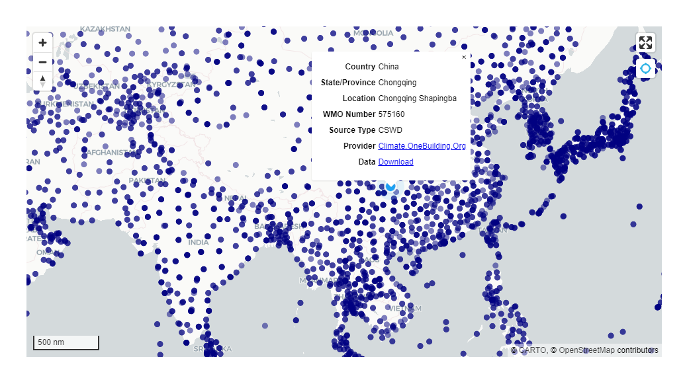

<!-- README.md is generated from README.Rmd. Please edit that file -->

```{r, include = FALSE}
knitr::opts_chunk$set(
  collapse = TRUE,
  comment = "#>",
  fig.path = "man/figures/README-",
  out.width = "80%"
)
```

# epwmap

<!-- badges: start -->
<!-- badges: end -->

> Interactive visualization of free available EPW sources use [Mapbox](https://docs.mapbox.com/mapbox-gl-js/api/)

## Installation

~You can install the released version of epwmap from [CRAN](https://CRAN.R-project.org) with:~

```r
install.packages("epwmap")
```

Alternatively, you can install the development version from GitHub.

```r
install.packages("epwmap", repos = "https://hongyuanjia.r-universe.dev")
```

## Example

This is a basic example which shows you how to solve a common problem:

```r
library(epwmap)
epwmap()
```

```{r, echo = FALSE}

```
